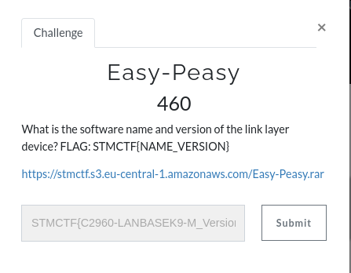
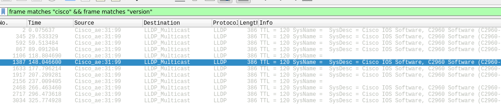
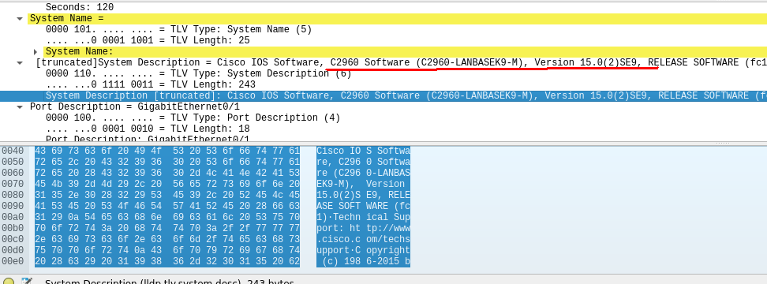

# easy-peasy

## Soru

## Çözüm

Bu soruda pcap dosyası veriliyor ve içerisinden layer 2'de çalışan cihazın ismini ve versiyonunu flag olarak girmemizi istemekteydi. Eminim birçok kişi bu soruda kanser olmuştur çünkü takım arkadaşımda baya uğraşmasına rağmen flagi tutturamadı :D. Soru kolay olmasına rağmen flagi tam olarak nasıl gireceğimizi bulamadığımız için soruyu çözen takım sayısı azdı.

CTF'in bitmesine son bir saat kala skor tablosunu kapatmışlardı. Bu zamana kadarda hiç bakmamıştım bu soruya, kolay olması sebebiyle indirdim ve Önce aşağıdaki şekilde bir filtreleme attım. 

Paketlere baktığımızda cihazı ve versiyonu aşağıdaki gibi görebiliyorduk.

Birkaç denemeden sonra flagi tutturdum. 

STMCTF{C2960-LANBASEK9-M_Version 15.0(2)SE9}

