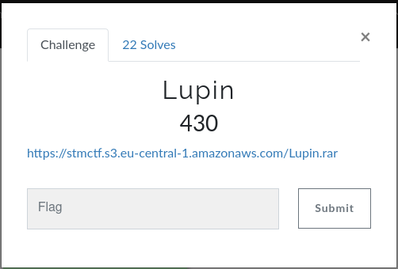
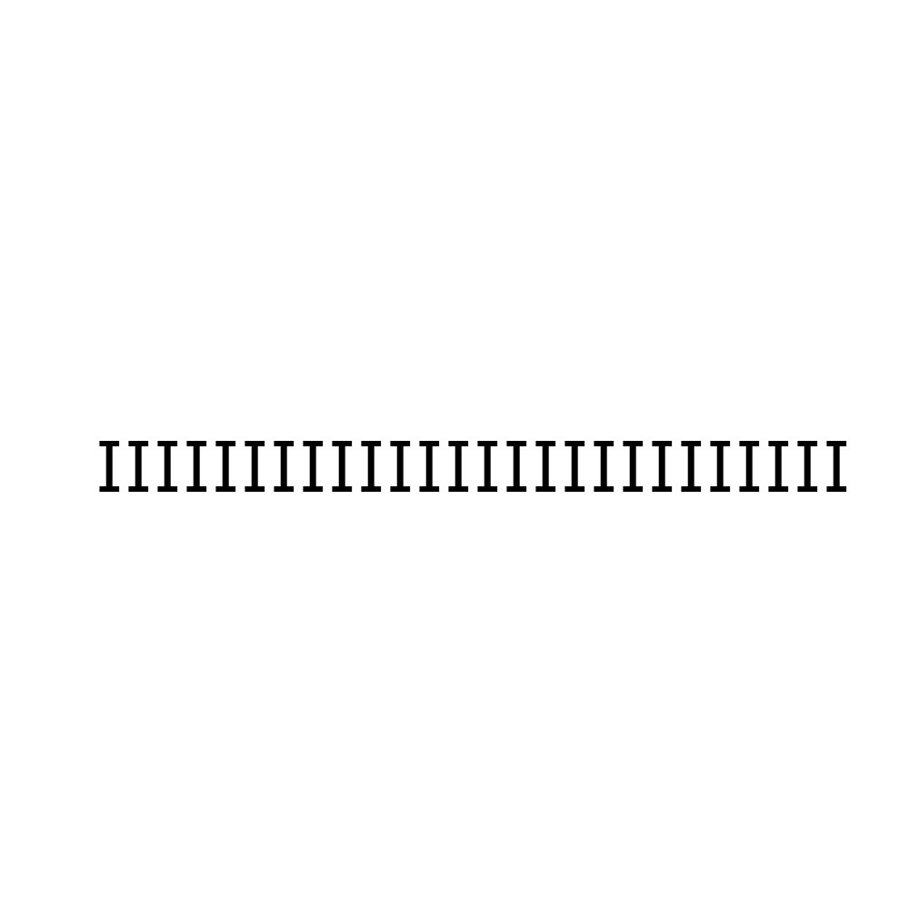
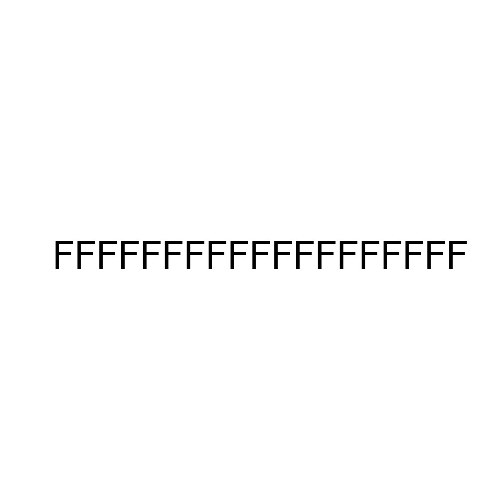
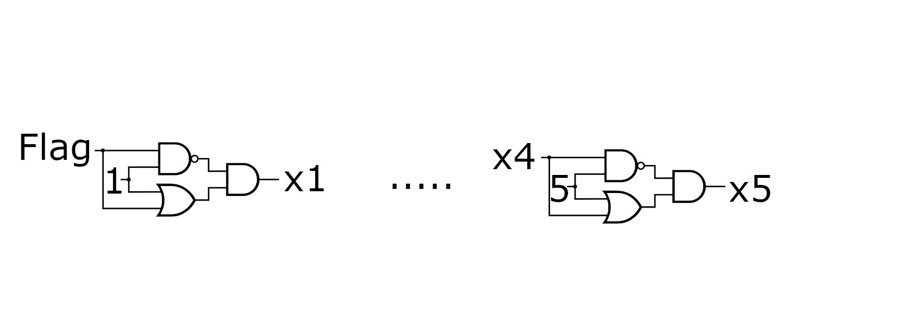
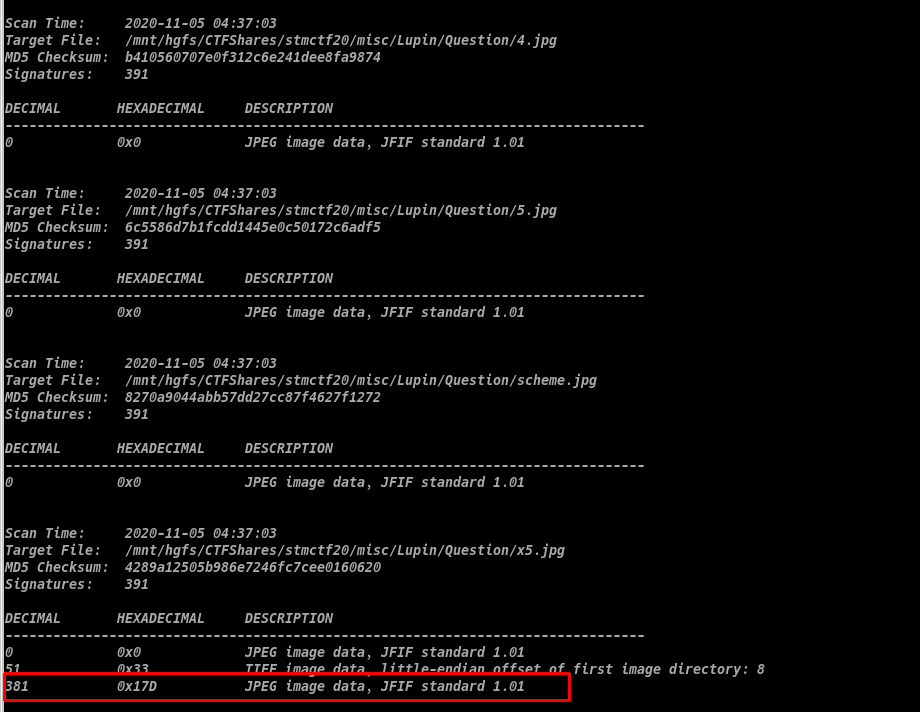
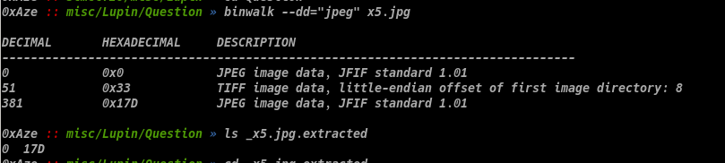

# Luping

Soru

Çözüm

Rar dosyasını açtığımızda içerisinde 6 adet jpg çıkıyor. Bu resimlere bakınca insan kör oluyor. 

Resimlere exif ile baktığımızda ilginç birşey görmüyoruz.

"Binwalk *" ile tüm resimlere baktığımızda x5.jpg dosyasında bir jpeg daha gömülü olduğunu görüyoruz. 

İçerisindeki jpeg'i çıkartıyoruz.

