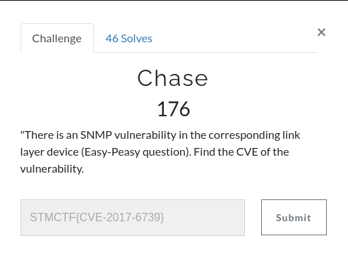
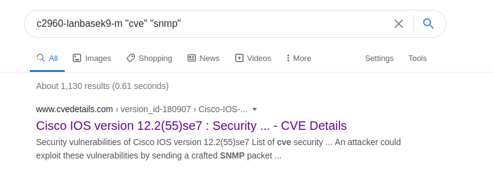
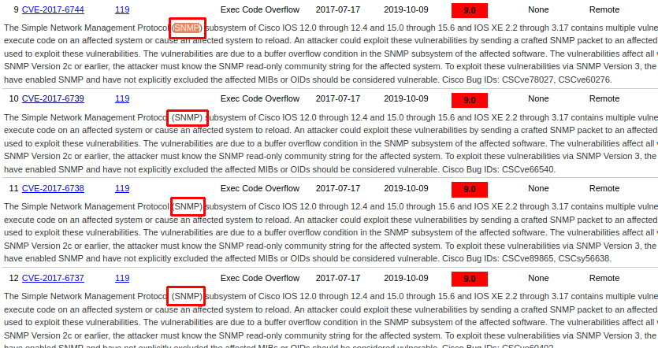

# Chase

## Soru 

Bu soruda bizden "Easy Peasy" sorusundaki cihazın SNMP protokolünde bulunan zafiyetin CVE numarası istenmekteydi. 

## Çözüm

Basitce cihazın modelini ve içerisinde CVE ve SNMP geçen bir arama yaptım. 

Yukarıdaki cve'leri deniyoruz ve bizim için doğru şık **"STMCTF{CVE-2017-6739}"**