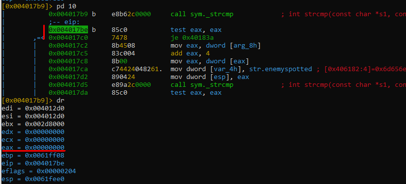
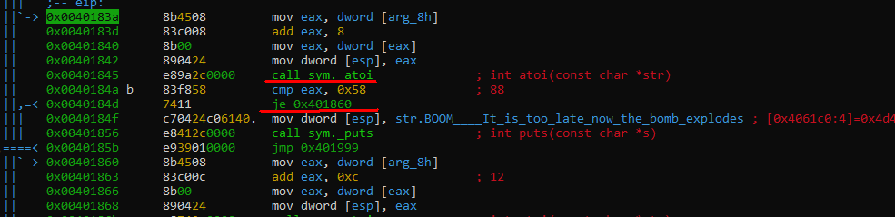

# CounterStrike !Bomb has been plant!

Çözüm

Dosya 32 bitlik upx ile sıkıştırılmış olarak gözükmektedir.

Önce upx ile dosyayı unpack ediyoruz.

Ardından dosyaları debuglamak için windows ortamina taşıyorum ve analiz başlasın.

Programı çalıştırdığımızda bize bombayı imha edebilmek için anahtar kelimeyi ve gizli numaralari bulmamızı ve aynı zamanda cryptexin şifresini çözmemizi söylüyor. 
Writeup'ı yazarken farkettim ki CTF sırasında programa parametre vermeden debugladığım için bazı fonksiyonların access_violation'a sebep olduğunu göreceğiz. Bunları çözmek için programı patchleyerek ilerledim. Yazının sonunda talimatlara uygun çözümü göstereceğim ama önce benim ilerlediğim şekilde anlatacağım.

Programı r2 ile açip "sym._main" fonksiyonunu disassembly ettiğimizde jmp insructionu defauseTheBomb yada program sonuna gittiğini görüyoruz.
"cmp argv, 6" ile programın argüman sayisi 6'dan farklı olduğunda bomba çözme talimatlarının olduğu bölüme dallanip doğrudan kapanmaktadir. Birde dikkatimizi strcat fonksiyonuna "aI" ve "nn" stringlerinin parametre olarak gittiğini görüyoruz. Belki de bomyayı çözmemiz için gereken anahtarın oluşma için gereken bir işlemdir diye umuyoruz.

Biz asıl görevimizi yapmak için defauseTheBomb fonksiyonuna bakacağız. Aşağıda IDA ile defauseTheBomb fonksiyonunun ölüm kalım haritasına bakalım.

Bizden "SafeVault" fonksiyonuna kadar ulaşmamız istenmektedir.

"SafeVault" fonksiyonuna doğru ilerlerken strcmp ve atoi fonksiyonlarına ve jmp instructionlarına dikkat etmemiz gerekecek. Yukarıdaki IDA graph görselinde bizi sol tarafa götüren tüm jmp'ları sağa doğru götürecek şekilde ayarlamam gerektiğini anlıyorum.

Ardından radare2 ile programın çalışma şeklini analiz ederek yönlendirmelerin yanlış olduğu adresleri bulacağız.

defauseTheBomb fonksiyonunun içerisinde ilk önce strcat fonksiyonu ile karşılaşıyoruz ve aşağıdaki stringleri birleştiriyor. Sanki anahtar oluşturuyor gibi hmm..

 
 Ardından karşılaştığımız ilk engel strcmp komutuna verilen anormal(\xff'lerden oluşan) uzun girdiden dolayı programın Access_Violation ile karşılaşıyoruz yani kısaca programın erişmek istediği adres alanına erişme izninin olmamasından dolayı kaynaklanmaktadır. Peki programı debug programına atmadan 5 parametre verip başlattığımızda neden access violationa takılmadı? Çünkü programa parametre vermediğimde strcmp'ye giden değer "\xff\xff..." şeklinde baya uzun bir alanı alıyor. Stringlerin sonunda (NULL=\0) işareti bulunduğunda fonksiyon stringi okumaya son verir. Ama burda sonu belli olmayan bir değeri parametre almaktadır. Reverse ile ilk tecrübelerimi yaşadığım için ctf sırasında bunun farkına varmadım. Çünkü programı parametresiz debug ediyordum ve fonksiyonlara resimdeki gibi parametreler gittiğini gördüğümde o kısımların kasıtlı yapıldığını düşünmüştüm. Ve bu şekilde access_violationlar yerken gerçekten bombanın patladığını hayal ediyordum bu yüzden kasıtlı yapıldığı fikrine kapılmıştım *-*. 

 Strcmp'yi atlattıktan sonraki adımda bir if statement ile karşılaşıyoruz. Aşağıdaki resimde kırmızıyla işaretlediğim kısımlarda eax registerinin değeri "0" olduğu için test eax,eax yani eax 0 ise "je" instruction ile belirtilen adrese zıplama gerçekleşecektir. 

Zıplama bizi doğru yöne götürdü için müdahale etmeyeceğiz.  

Şuanda buradayız B side'a doğru rushluyoruz. 

Bulunduğumuz yerdeki atoi fonksiyonu strcmp'deki aynı sebepten dolayı "access_violationa" sebep oluyordu. 

  

