# CounterStrike !Bomb has been plant!

Çözüm

Dosya 32 bitlik upx ile sıkıştırılmış olarak gözükmektedir.

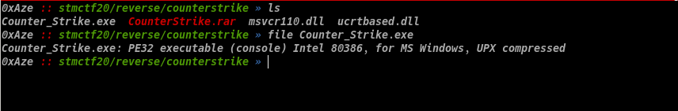

Önce upx ile dosyayı unpack ediyoruz.

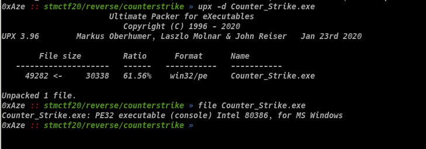

Ardından dosyaları debuglamak için windows ortamina taşıyorum ve analiz başlasın.

Programı çalıştırdığımızda bize bombayı imha edebilmek için anahtar kelimeyi ve gizli numaralari bulmamızı ve aynı zamanda cryptexin şifresini çözmemizi söylüyor. 

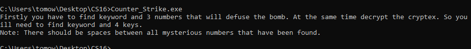

Programı r2 ile açip "sym._main" fonksiyonunu disassembly ettiğimizde jmp insructionu defauseTheBomb yada program sonuna gittiğini görüyoruz.
"cmp argv, 6" ile programın argüman sayisi 6'dan farklı olduğunda bomba çözme talimatlarının olduğu bölüme dallanip doğrudan kapanmaktadir. Birde dikkatimizi strcat fonksiyonuna "aI" ve "nn" stringlerinin parametre olarak gittiğini görüyoruz. 

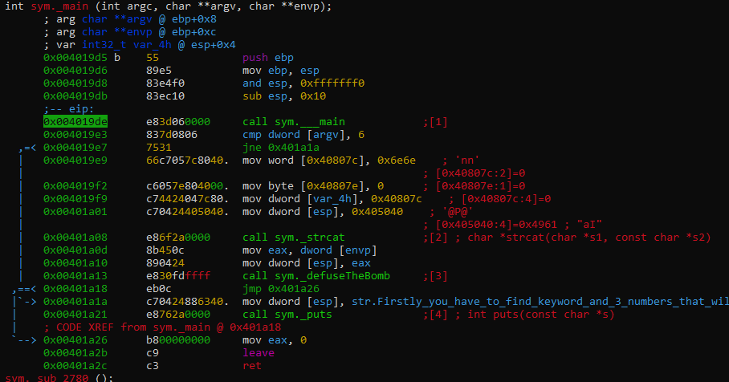

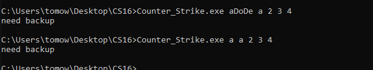

Biz asıl görevimizi yapmak için defauseTheBomb fonksiyonuna bakacağız. Aşağıda IDA ile defauseTheBomb fonksiyonunun ölüm kalım haritasına bakalım.

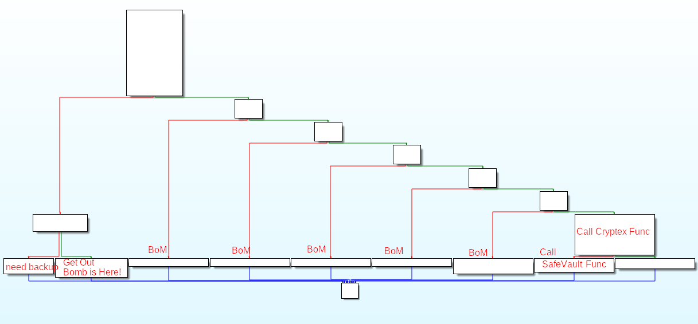

Bizden "SafeVault" fonksiyonuna kadar ulaşmamız istenmektedir.

"SafeVault" fonksiyonuna doğru ilerlerken strcmp ve atoi fonksiyonlarına ve jmp instructionlarına dikkat etmemiz gerekecek. Yukarıdaki IDA graph görselinde bizi sol tarafa götüren tüm jmp'ları sağa doğru götürecek şekilde ayarlamam gerektiğini anlıyorum.

Ardından radare2 ile programın çalışma şeklini analiz ederek yönlendirmelerin yanlış olduğu adresleri bulacağız.

defauseTheBomb fonksiyonunun içerisinde ilk önce strcat fonksiyonu ile karşılaşıyoruz ve aşağıdaki stringleri birleştiriyor. Ne işe yaradığını henüz bilmiyoruz belki bir anahtar oluşturuyor olabilir.   

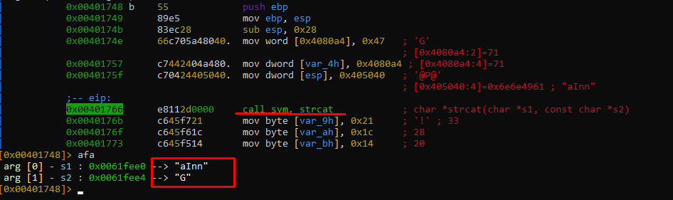
 
 Ardından karşılaştığımız ilk engel strcmp komutuna verilen anormal(\xff'lerden oluşan) uzun girdiden dolayı programın Access_Violation ile karşılaşıyoruz yani kısaca programın erişmek istediği adres alanına erişme izninin olmamasından dolayı kaynaklanmaktadır. Peki programı debug programına atmadan 5 parametre verip başlattığımızda neden access violationa takılmadı? Çünkü programa parametre vermediğimde strcmp'ye giden değer "\xff\xff..." şeklinde baya uzun bir alanı alıyor. Stringlerin sonunda (NULL=\0) işareti bulunduğunda fonksiyon stringi okumaya son verir. Ama burda sonu belli olmayan bir değeri parametre almaktadır. Reverse ile ilk tecrübelerimi yaşadığım için ctf sırasında bunun farkına varmadım. Çünkü programı parametresiz debug ediyordum ve fonksiyonlara resimdeki gibi parametreler gittiğini gördüğümde o kısımların kasıtlı yapıldığını düşünmüştüm. Ve bu şekilde access_violationlar yerken gerçekten bombanın patladığını hayal ediyordum bu yüzden kasıtlı yapıldığı fikrine kapılmıştım. Programı patchleyerek bazı adreselerdeki fonksiyonları "nop" instructionu ile değiştirdim ve zıplamaları doğru alanlara gidecek şekilde ayarladım. Ve flagi elde ettim.

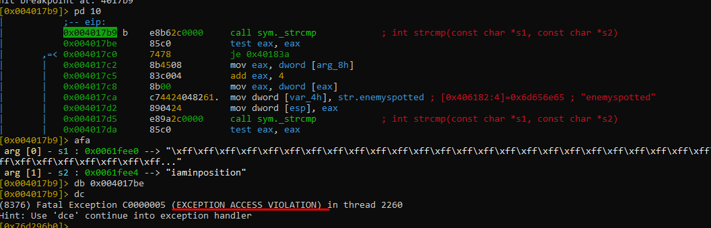

###Programın bizden istediği çözüm yolunda ise
Programa CounterStrike.exe val1 val2 val3 val4 val5 şeklinde parametreler vererek test ettiğimizde aslında strcmp val1 ile "iaminposition" stringini karşılaştırmaktadır. Eğer eşit değilse program çıkışa yönlendirilmektedir.    

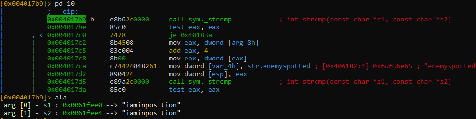

Bu yüzden programı radare2 kullanıyorsanız "ood iaminposition val2 val3 val4 val5" şeklinde reload ediyoruz ve 0x004017b9 adresine breakpoint koyarak bu kısma kadar programı çalıştıralım. 

Şuanda buradayız B side'a doğru rushluyoruz. 

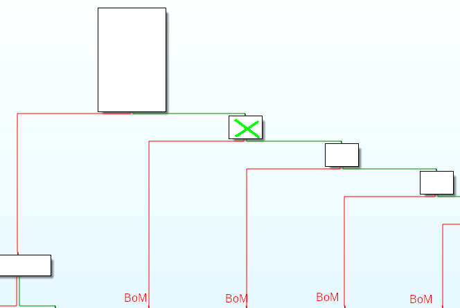

Tüm atoi fonksiyonları, karşılaştırma ve zıplama noktalarını aşağıdaki resimden kontrol edersek
"CounterStrike.exe iaminposition val2 val3 val4 val5" şeklinde parametre vererek debug ettiğimizde sırasıyla
if val2 == 88  ;ise zıpla
if val3 > 35 
if val3 <= 44  ; 35 < val3 <= 44 ise zıpla
if val4 > 98     
if val4 <= 999 ; 98 < val4 <= 999 ise zıpla
girdiğimiz değerlerin belirtilen aralıklarda kontrol edildiğini görüyoruz. 
Biraz işaretlediğim alanları açıklamak gerekirse Atoi fonksiyonu char tipindeki bir sayı değerini integer tipine çevirmek için kullanılmaktadır. Yani parametre olarak girdiğimiz string "88" değerini integera çevirdikten sonra sonucu eax registerina hexadecimal olarak "58" şeklinde döndürecek. Ardından cmp ve je komutları ile eax registerindeki değer ile belirtilen aralıklar veya eşitlikler sağlanıyorsa zıplama gerçekleşecek.

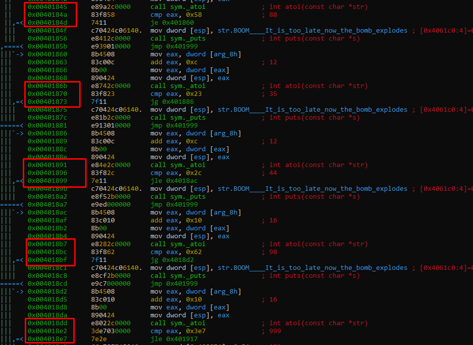

Tekrardan radare2 için parametreleri "ood iaminposition 88 44 999 val5" komutuyla ayarlayalim ve başlatalım. Artık "breaktheCryptex" fonksiyonuna kadar ilerleyebiliyoruz. Program bize "tebrikler bombayı yok ettin sırada cryptex var" mesajını vermektedir.

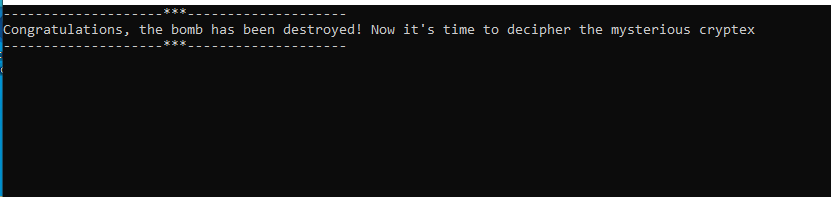

Bu fonksiyona breakpoint koyarak devam edelim ve disassembly edelim.

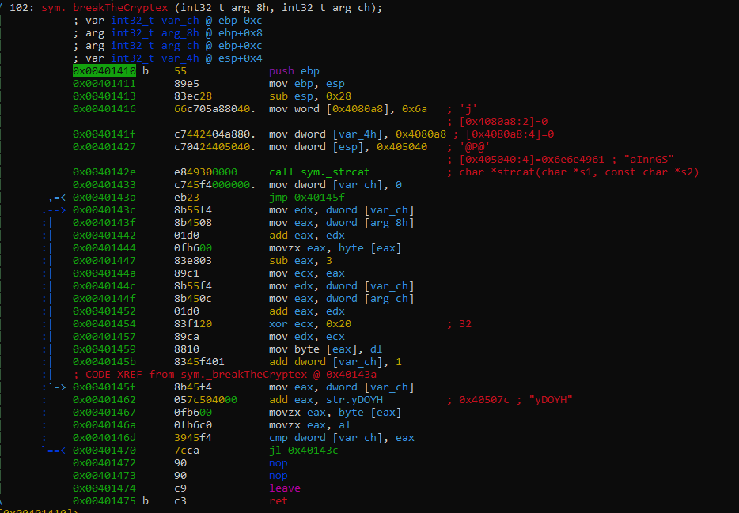

Fonksiyonu çalıştırdığımızda döngü içerisinde "yDOYH" stringiyle bir takım işlemler sonrasında stacke "Valve" yazıldığını görüyoruz. "breaktheCryptex" fonksiyonuna parametre olarak giden "0x0061f3f0" adresinde bu stringi görmekteyiz.

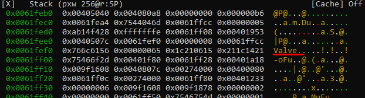

Cryptex fonksiyonundan çıktıntan sonra ilk strcmp çağrısına breakpoint koyuyoruz ve giden parametrelere baktığımızda programa verdiğimiz son parametre "val5" ile "Valve" stringinin eşitlik kontrolünün yapıldığını görmekteyiz.

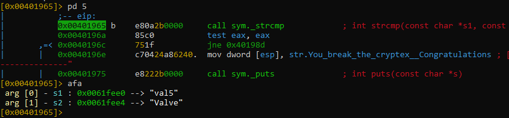

Programa tekrardan "ood iaminposition 88 44 999 Valve" parametrelerini verdikten sonra devam ettiğimizde artık rahatlıkla "safeVault" fonksiyonuna ulaşabiliyoruz.

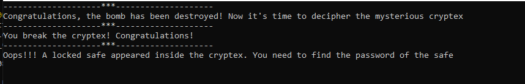

"safeVault" fonksiyonunu incelediğimizde bizden 2 input istemektedir. Öncelikle maximum 5 karakterden oluşan bir password girmemizi ve ardından girdiğimiz password ile oluşturulan güvenli anahtarı istemektedir. 

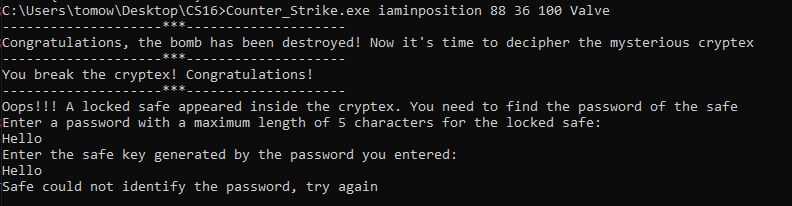

Ozaman bizden ilk istediği passwordu rastgele "AAAAA" giriyorum ve scanf fonksiyonundan sonraki adrese breakpoint koyarak analiz ediyorum.

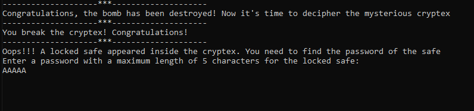

Aşağıdaki kısımda girdiğimiz inputun uzunluğu kadar tekrarlanan bir loop var. Bu loop girdiğimiz stringin her bir karakterini 2 arttırarak oluşan yeni string değerini Stack'e yazmaktadır. 

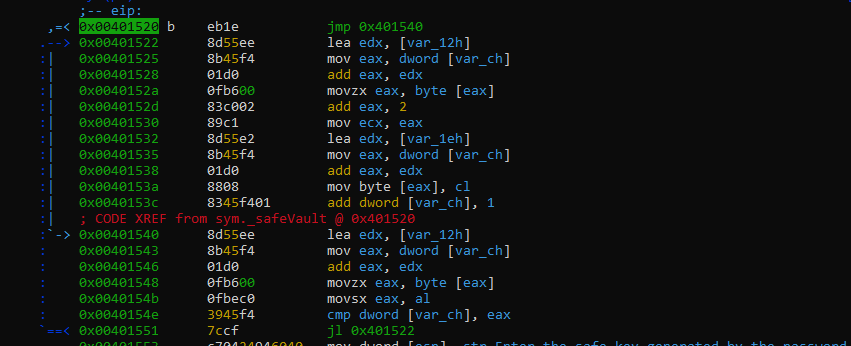

Yani "A" + 2 eklediğimizde --> "C" karakteri olmaktadır. Programın ürettiği "safe key" "AAAAA" için "CCCCC" olacaktır.

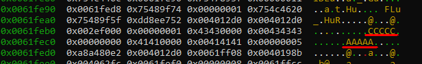

Üretilen stringi girerek flagi elde ediyoruz.

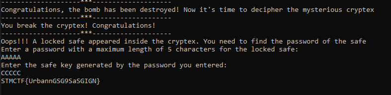

Program başından beri her doğru adımda strcat fonksiyonuna "aI+nn+G+S+j+a" stringlerini birleştirerek gitti. CTF sırasında anahtar olarak az denemedim. Program son kısımda flag oluşturmada kullanılıyormuş. 
Ve bu roundun kazananı  
## Counter-Terorist Win

