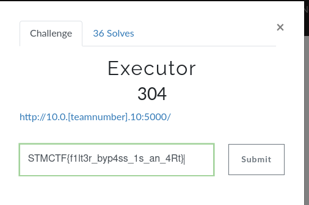
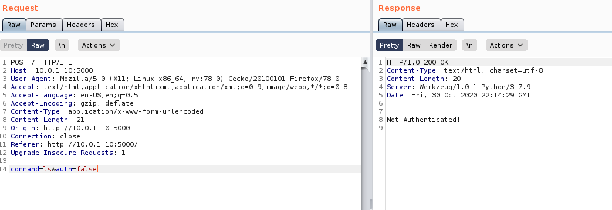
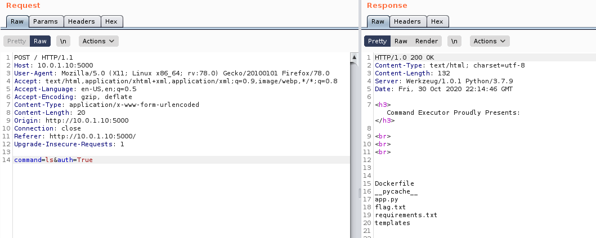
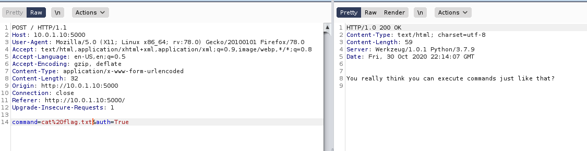
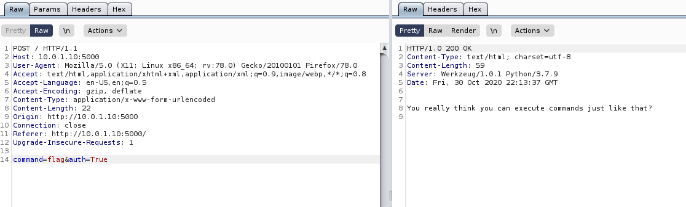
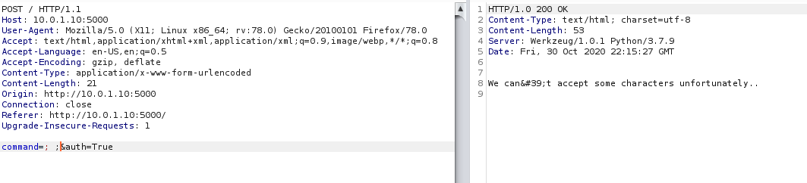
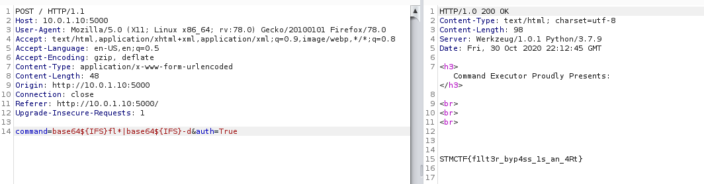

# Executor

## Soru

## Çözüm

Soruda bizden filterleri atlatarak sistemde komut çalıştırmamızı istemekteydi. 

Bir post isteğimiz vardı burp ile açıp repeteare atıyoruz "auth&commnad" şeklinde iki adet parametremiz vardı. Auth parametresi default false olarak geliyordu. O şekilde bir istek attığımızda "Not Authenticated" şeklinde response almaktayız.  

Auth parametresini "true" olarak değiştiriyoruz. Ardından komut çalıştırabilir yetkide oluyorduk. 

Bulunduğumuz dizinde flag.txt'yi görebilmekteyiz. Yapmamız gereken sadece cat flag.txt

Ordasın ama ulaşamıyorum çok saçma!

Filterlerlanan karakterleri test etmek için denemeler yapmaya başladım. Dosya okumaya yarayan komutların birçoğu, space karakteri, "flag" gibi stringleri filterliyordu. 

**Ozaman ihtiyacımız olanlar:**
1- Dosyayı okuyabilecek bir komut
2- Boşluk karakteri
3- flag.txt'yi belirtecek bir alias yada tamamlayıcı

**Sırasıyla kullandığım çözümler:**
1- Base64
2- ${IFS}
3- fl*

